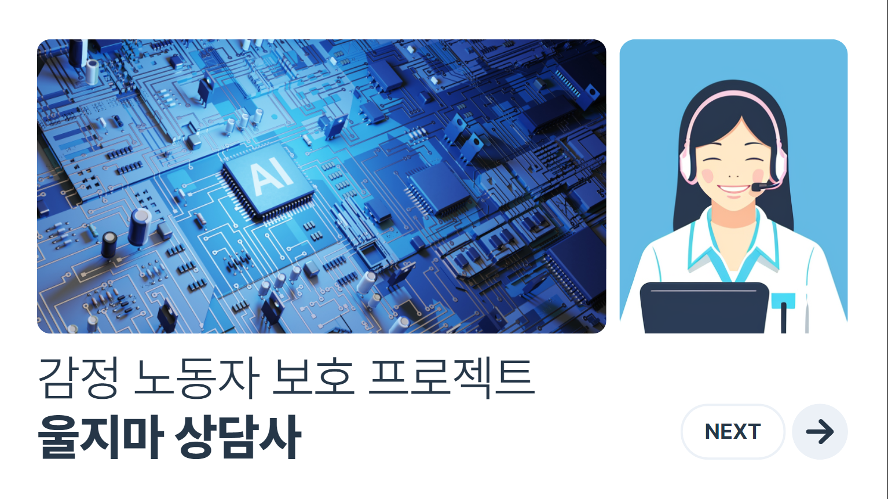
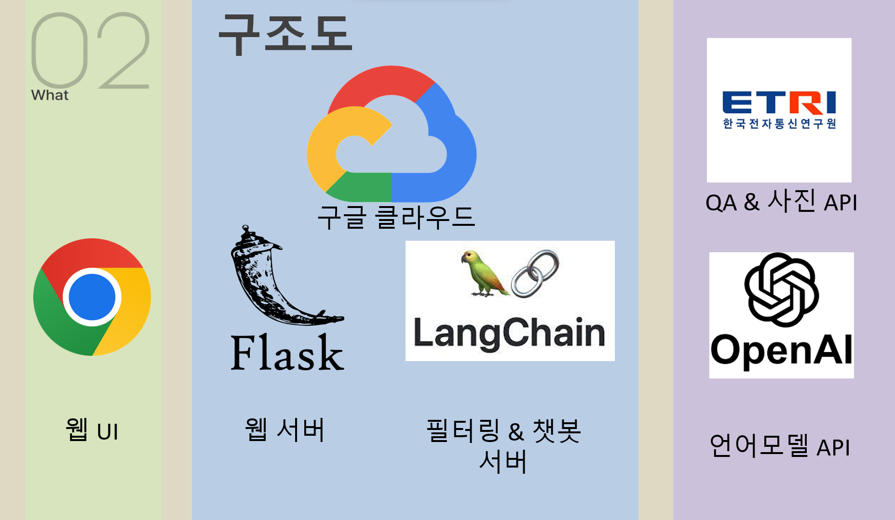

# 울지마 상담사 docs
학교의 선생님들이 상담과정에서 많이 고통받아 발생하는 사건들을 해결하고자 시작한 감정 노동자 보호 프로젝트의 문서 저장소로, 2023년 2학기 이태규 교수님 수업인 `스마트팩토리프로젝트`에서 한 학기동안  수업에서 토론하며 개발한 프로젝트 입니다.

**참여자**  
- 김소은(학생): 언어/이미지 필터링 기능
- 이정한(학생): 챗봇 및 서버 구축
- 이태규(교수): 프로젝트 방향성 및 해결책 제안

---

# 기능 동작 영상

# PPT (사진 클릭)

- [미리캔버스 뷰어](https://www.miricanvas.com/v/12oe798)

---

# 전체 기능

## 1. 채팅

### 1-1. AI 챗봇
AI챗봇에게 미리 관련내용을 알려주고 관련 질문을 대답할 수 있게 해서 상담사에게 직접가는 부정표현 노출을 낮춤

- 부정표현 필터링 불필요
- 미리 문서등록, 검색 등으로 관련 내용 상담 기능
- 이미지 분석기능

### 1-2. 상담사 채팅
상담사와 고객의 직접 채팅시 텍스트의 부정표현과 혐오 이미지 필터링으로 상담사를 보호

- 부정표현 필터링 (탐지 후 순화해서 전달)
- 혐오 이미지 필터링 (탐지 후 블러링 → 블러링 말고 아예 안보내는 것)
- AI챗봇 전환 기능 (자동: 수치판별, 수동: 상담사 선택)

## 2. 음성 통화

### 2-1. AI 음성챗봇
사용자의 음성을 받아 텍스트로 변환후 AI챗봇을 기반으로 한 대답을 생성하고 다시 AI목소리 서비스 음성으로 응답해서 실제 통화와 비슷하게 구현

- 부정표현 필터링 불필요

### 2-2. 상담사 음성통화 (구현 실패)
상담사와 민원인의 직접 음성 통화할 때 고객의 목소리를 AI목소리로 변조해서 부정적인 비언어적인 표현(목소리 크기, 말투)을 순화

- 부정표현 필터링 (실시간 음성 마스킹)
- 실시간으로 민원인의 음성을 텍스트로 변경후 AI목소리 서비스로 전달 (비언어적 표현 순화 목적)
- AI챗봇 전환 기능 (자동: 수치판별, 수동: 상담사 선택)

### 2-3. 상담사 텍스트 통화

기본적인 통화방식에서 고객의 욕설과 비언어적표현(괴성)을 필터링하기 위해 고객의 음성을 직접 상담사에게 들려주지 않고, 텍스트로 보여준다. 상담사는 전달받은 텍스트를 읽고 음성으로 고객에게 답장한다. (고객 입장에서는 여전히 자신의 목소리를 듣고 상담하는 것으로 인지)

- 고객: 입력(음성), 출력(텍스트)
- 상담사: 입력(음성), 출력(음성)

- 실시간 STT 텍스트 부정표현 필터링
- AI챗봇 전환 기능 (자동: 수치판별, 수동: 상담사 선택)
- STT로 변환된 텍스트를 조금의 딜레이 있이 구글 자연어 API 감정분석을 통해 부정표현 수치 실시간 기록

## 3. 부가 기능
- 기록을 토대로 개인의 부정표현 점수 데이터화 -> 민원신청시 필터링

---

# 흐름도

# 구조도

# 사용된 기술

# 기대효과

---

# 공모전
[자세히](공모전.md)
### [평택대학교 2023학년도 융합소프트웨어학과 학술제 및 소프트웨어공모전]
금상

### [2023 ETRI 오픈 API 활용사례 공모전](https://aiopen.etri.re.kr/viewNotice?id=114)
최우수상

---

# 맺음말
저희의 프로젝트는 상담과정에서 발생하는 사건들을 근본적으로 해결하지 못합니다.

저희는 프로젝트 초창기에 악성민원으로 발생하는 사건들의 근본적인 문제점과 해결책을 생각해본 적이 있습니다. 과거와 달리 교사와 학생이 각각 권리를 먼저 내세우고, 모든것을 무조건 법으로 해결하려는 사회의 인식문제가 가장 원론적인 문제라고 생각했습니다. 최소한의 울타리인 법을 가장 먼저 적용하려는것이 아니라, 서로 먼저 존중해주는 사회가 되는게 진짜 해결법이라고 생각합니다.
